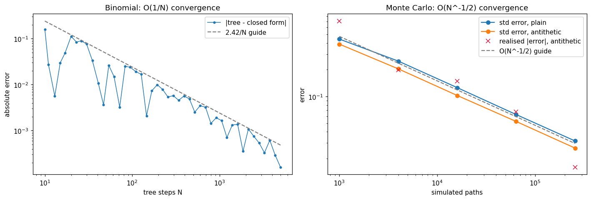
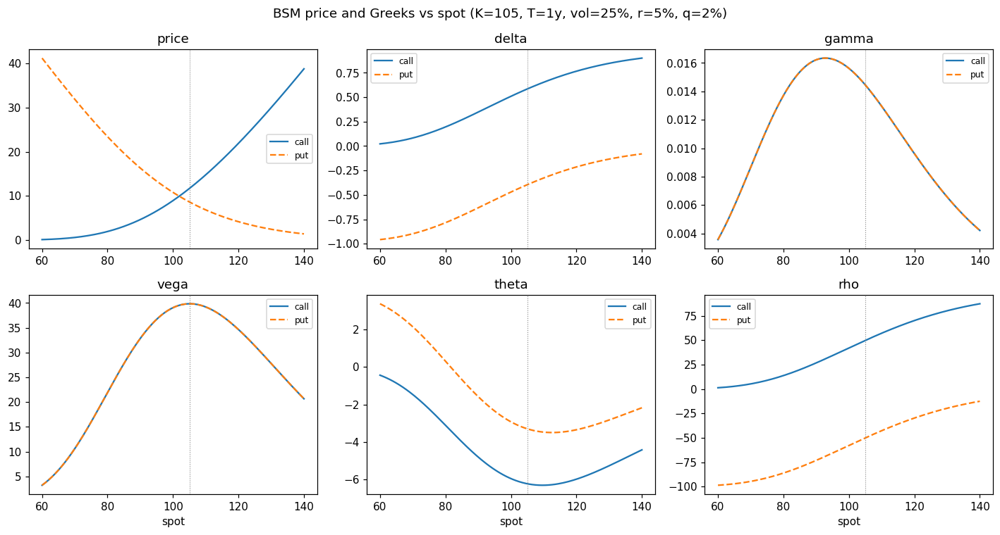
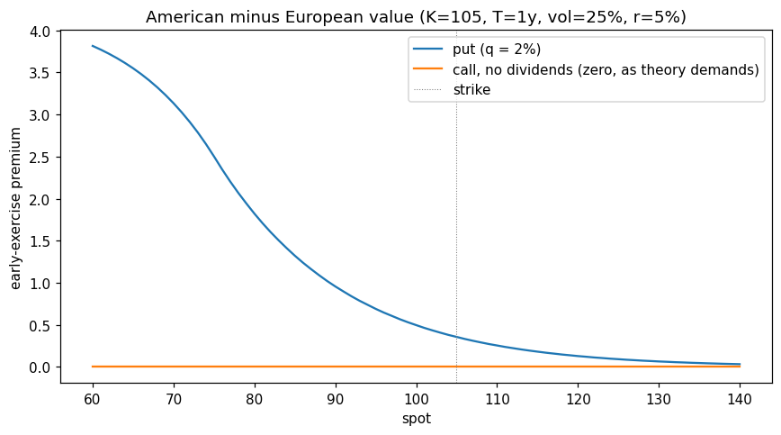
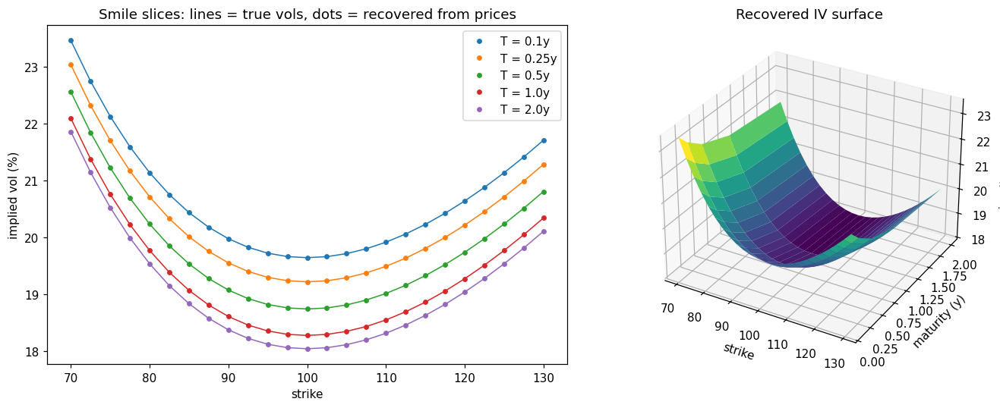

# options-pricing-lib

**Implemented and cross-validated three option-pricing methods — Black-Scholes-Merton
closed form, Cox-Ross-Rubinstein binomial tree, and Monte Carlo simulation — with full
Greeks, an implied-volatility solver, and IV-surface construction.** Any one of these
pricers is textbook material; the point of the project is the validation. Three
independently built engines agree to their theoretical error bounds, convergence rates
match theory, a model-free identity (put-call parity) holds to machine precision, and
the places where the numerics genuinely break down are identified and handled rather
than papered over. That discipline is how pricing code earns trust in practice, and it
is encoded permanently in a 174-test suite.

## Methods

| Engine | Scope | Validated against |
|---|---|---|
| `black_scholes` | European calls/puts, continuous dividend yield; analytic delta, gamma, vega, theta, rho | Hull's reference values; put-call parity; Greeks vs central finite differences |
| `binomial` | European **and American** exercise (CRR tree, vectorised rollback) | Closed form at O(1/N); American call (q=0) = European; American put premium ≥ 0, pins to intrinsic deep ITM |
| `monte_carlo` | European, GBM terminal sampling, antithetic variates, seeded and reproducible; every price carries a standard error | Closed form within 3 standard errors; antithetic variance reduction verified |
| `greeks` | Bump-and-reprice numerical Greeks against **any** engine (the only route to American Greeks here) | Analytic BSM Greeks at rel. 1e-4 |
| `implied_vol` / `vol_surface` | Brent inversion with no-arbitrage floor/cap rejection; quote-grid → IV surface | Exact round-trip: price at σ, invert, recover σ |

## Results

**The three engines agree, and their errors die at the theoretical rates** — O(1/N)
for the tree (riding its measured 2.42/N guide for three decades, sawtooth and all)
and O(N^-1/2) for Monte Carlo, with antithetic variates buying a constant-factor
improvement:



**Full Greeks across spot** (solid = call, dashed = put; gamma and vega coincide for
the two, as they must):



**American exercise behaves the way theory demands**: computed on the same tree so
discretisation error cancels, the early-exercise premium is exactly zero for a call on
a non-dividend payer (Merton) and grows with moneyness for the put, which pins to
intrinsic deep ITM:



**The implied-vol surface round-trips**: synthetic quotes generated from a known smile
are inverted back to vols that sit exactly on the true curves (max error ~1e-9 across
the grid), for both smile slices and the full surface:



Put-call parity — model-free, so it must hold to float precision, not to a tolerance —
holds to ~1e-14 across a strikes × maturities grid (see the notebook and
`tests/test_black_scholes.py`).

## Usage

```python
from optionslib import ExerciseStyle, Option, OptionType
from optionslib import binomial, black_scholes, greeks, monte_carlo
from optionslib.implied_vol import implied_volatility

opt = Option(spot=100, strike=105, maturity=1.0, rate=0.05,
             volatility=0.25, dividend_yield=0.02, option_type=OptionType.CALL)

black_scholes.price(opt)                      # 8.9412
black_scholes.greeks(opt)                     # {'delta': 0.510, 'gamma': 0.0156, ...}
binomial.price(opt, steps=2000)               # 8.9422  (European tree)
monte_carlo.price(opt, n_paths=500_000, seed=42)
# MCResult(price=8.9486, std_error=0.0189, n_paths=500000)

american = Option(spot=100, strike=105, maturity=1.0, rate=0.05, volatility=0.25,
                  option_type=OptionType.PUT, style=ExerciseStyle.AMERICAN)
binomial.price(american, steps=2000)          # 10.6423, early-exercise premium included
greeks.numerical(opt, black_scholes.price)    # bump-and-reprice, any engine

implied_volatility(8.9412, opt)               # 0.25 — round-trips
```

## Running it

```bash
pip install -e ".[dev]"
pytest                                   # 174 tests
jupyter notebook notebooks/demo.ipynb    # the walkthrough that produced the plots
```

## Design notes

- Conventions: continuous compounding, continuous dividend yield q, theta per year,
  vega/rho per unit (divide by 100 for per-point desk numbers).
- The IV solver rejects quotes outside the no-arbitrage band `[floor, cap]` with a
  clear error instead of surfacing a root-finder bracket failure; surface cells that
  violate the bounds come back NaN rather than failing the grid.
- Degenerate limits are handled explicitly: T = 0 returns intrinsic, σ = 0 the
  discounted forward intrinsic (for the zero-vol American case, the best discounted
  exercise along the deterministic path); Greeks refuse the degenerate limits, where
  delta is a step function, rather than dividing by zero.
- Two numerical realities are documented and tested rather than hidden: IV inversion
  accuracy is conditioning-limited by vega (deep ITM short-dated low-vol quotes can sit
  bit-for-bit on the arbitrage floor, where no vol is recoverable and the solver
  refuses), and the CRR tolerance is set from the measured error constant (N·|error| ≈
  2.42 for the test case), not from wishful thinking.

## Limitations / what I'd do next

- **Constant-vol GBM world**: no local/stochastic vol, no term structure of rates or
  vol, no discrete dividends. The surface construction inverts quotes; it does not fit
  or interpolate an arbitrage-free surface (SVI would be the natural next step).
- **American exercise only via the tree.** I would add Longstaff-Schwartz least-squares
  Monte Carlo as an independent cross-check on the early-exercise premium.
- **Scalar API**: one contract per call. Vectorising over strike/maturity grids would
  matter for real surface work; it was deliberately traded away for clarity here.
- **No market data.** All validation is against theory and synthetic quotes. Feeding a
  real options chain through the surface builder (and confronting bid/ask, discrete
  dividends, and the American-ness of single-name options) is the follow-on project.
